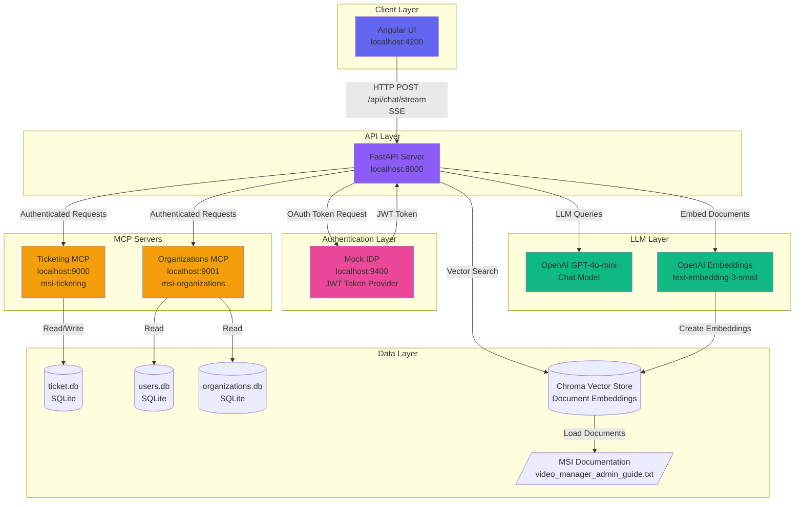

# System Overview Architecture

## High-Level System Architecture

## Component Ports

| Component | Port | Protocol | Purpose |
|-----------|------|----------|---------|
| Angular UI | 4200 | HTTP | User interface |
| FastAPI Server | 8000 | HTTP | Main API backend |
| Mock IDP | 9400 | HTTP | OAuth/JWT authentication |
| Ticketing MCP | 9000 | HTTP | Support ticket management |
| Organizations MCP | 9001 | HTTP | User/org data retrieval |

## Data Flow

1. **User Request**: Angular UI → FastAPI Server
2. **Authentication**: FastAPI → Mock IDP (get JWT token)
3. **LLM Processing**: FastAPI → OpenAI (chat completion with tools)
4. **Tool Execution**: LLM decides to call MCP tools
5. **MCP Operations**: FastAPI → MCP Servers (with JWT auth)
6. **RAG Retrieval**: FastAPI → Vector Store (semantic search)
7. **Response**: Streaming SSE back to Angular UI
