# Directory Structure Architecture

## Project Directory Structure

```mermaid
graph TD
    ROOT[msi-ai-assistant/]

    ROOT --> SRC[src/]
    ROOT --> DATA[data/]
    ROOT --> UI[ai-assistant-ui/]
    ROOT --> DOCS[docs/]
    ROOT --> SCRIPTS[scripts/]

    SRC --> CORE[core/<br/>Agent, Config, Utils]
    SRC --> API[api/<br/>FastAPI Server]
    SRC --> AUTH[auth/<br/>Auth Logic]
    SRC --> MCP[mcp/<br/>MCP Servers]
    SRC --> RAG[rag/<br/>RAG Agents]
    SRC --> MODELS[models/<br/>Data Models]
    SRC --> CLI[cli/<br/>CLI Tools]
    SRC --> MAIN[main.py<br/>CLI Entry]

    API --> APIROUTES[routes/<br/>Future Routes]
    API --> APIMID[middleware/<br/>Future Middleware]
    API --> APISERVER[server.py<br/>FastAPI App]

    AUTH --> AUTHIDP[mock_idp.py<br/>OAuth Provider]
    AUTH --> AUTHUTILS[utils.py<br/>JWT Helpers]
    AUTH --> AUTHSTORE[token_store.py<br/>Token Storage]

    MCP --> MCPTICK[ticketing/<br/>server.py]
    MCP --> MCPORG[organizations/<br/>server.py]

    RAG --> RAGBASE[base.py<br/>BaseRAGAgent]
    RAG --> RAGREG[registry.py<br/>RAGAgentRegistry]
    RAG --> RAGAGENTS[agents/<br/>msi_docs.py]

    DATA --> DATADB[databases/<br/>ticket.db, users.db, organizations.db]
    DATA --> DATAVEC[vector_stores/<br/>Chroma embeddings]
    DATA --> DATADOC[documents/<br/>MSI documentation]

    DOCS --> DOCSDIAG[diagrams/<br/>Architecture diagrams]

    style ROOT fill:#6366f1
    style SRC fill:#8b5cf6
    style DATA fill:#ec4899
    style MCP fill:#f59e0b
    style RAG fill:#10b981
```



## Module Organization

### Core (`src/core/`)
- **agent.py**: LangChain agent initialization
- **config.py**: Centralized configuration constants
- **utils.py**: Shared utilities (logging, etc.)

### API (`src/api/`)
- **server.py**: FastAPI application with chat endpoints
- **routes/**: Future route modules (empty for now)
- **middleware/**: Future middleware (empty for now)

### Auth (`src/auth/`)
- **mock_idp.py**: Mock OAuth2/OIDC identity provider
- **utils.py**: JWT verification and role checking
- **token_store.py**: OAuth token storage infrastructure

### MCP (`src/mcp/`)
- **ticketing/server.py**: Support ticket management MCP server
- **organizations/server.py**: User/organization data MCP server

### RAG (`src/rag/`)
- **base.py**: Abstract base class for RAG agents
- **registry.py**: RAG agent registry and factory
- **agents/msi_docs.py**: MSI documentation RAG agent

### Data (`data/`)
- **databases/**: SQLite database files
- **vector_stores/**: Chroma vector embeddings
- **documents/**: Source documentation files

## Import Path Convention

All imports use absolute paths with `src.` prefix:

```python
from src.core.config import DEFAULT_MODEL
from src.auth.utils import check_roles
from src.rag.registry import create_default_rag_tools
```
