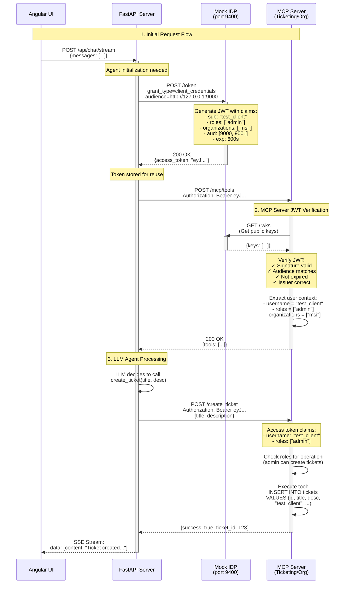
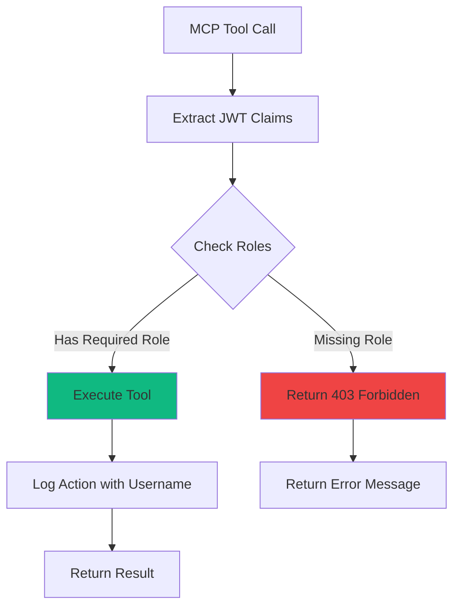

# Authentication Flow Architecture

## OAuth 2.0 / JWT Authentication Flow



## JWT Token Structure

### Token Claims
```json
{
  "sub": "test_client",
  "aud": [
    "http://127.0.0.1:9000",
    "http://127.0.0.1:9001"
  ],
  "iss": "http://127.0.0.1:9400",
  "exp": 1234567890,
  "iat": 1234567290,
  "roles": ["admin"],
  "organizations": ["msi", "eng"]
}
```

### Key Components

| Component | Purpose |
|-----------|---------|
| **sub** | Subject (client/user identifier) |
| **aud** | Audience (which MCP servers can accept this token) |
| **iss** | Issuer (Mock IDP URL) |
| **exp** | Expiration time (10 minutes) |
| **iat** | Issued at time |
| **roles** | User roles for authorization |
| **organizations** | User's organization memberships |

## Multi-Audience Strategy

The JWT includes **multiple audiences** to allow one token for all MCP servers:

```python
# Mock IDP issues token with both MCP server URLs
"aud": [
    "http://127.0.0.1:9000",  # Ticketing MCP
    "http://127.0.0.1:9001"   # Organizations MCP
]
```

This enables **Single Sign-On (SSO)** across all MCP servers with one authentication flow.

## Role-Based Access Control (RBAC)

### Authorization Flow



### Role Hierarchy

| Role | Permissions |
|------|-------------|
| **admin** | Full access to all operations |
| **user** | Read-only access, can create tickets |
| **viewer** | Read-only access only |

### Implementation

```python
from src.auth.utils import check_roles

@mcp.tool()
async def create_ticket(title: str, description: str):
    # Only admins and users can create tickets
    check_roles(["admin", "user"])

    username = get_username()  # From JWT
    # ... create ticket logic
```
