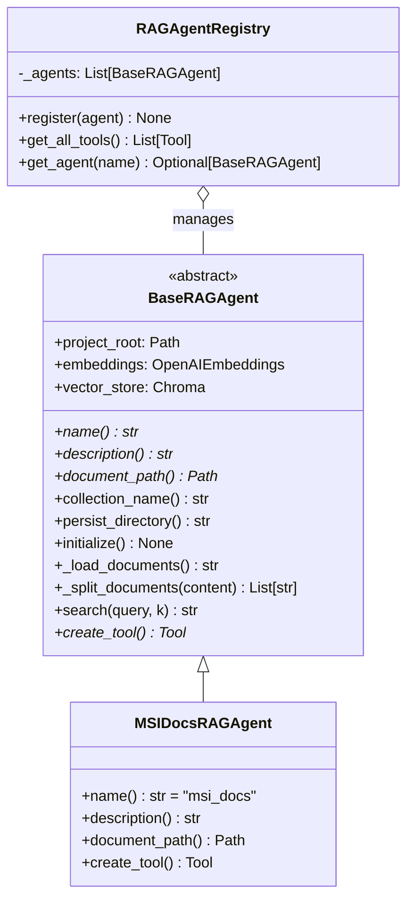
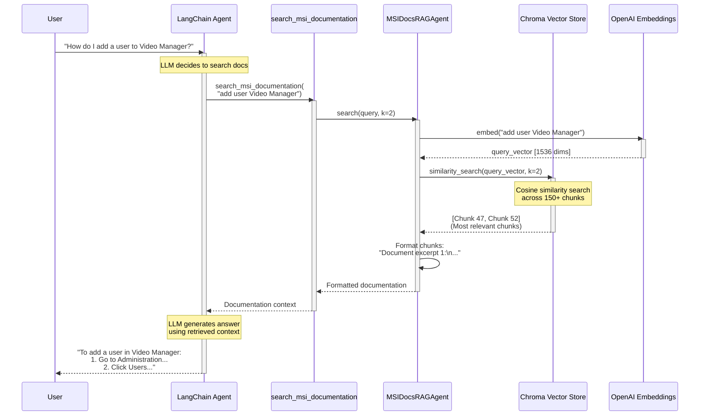
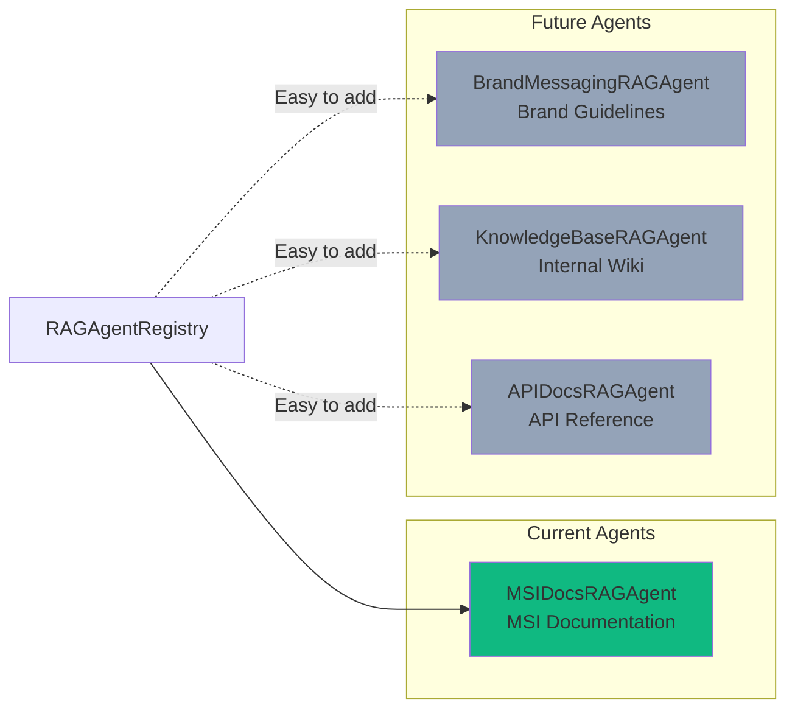

# RAG (Retrieval-Augmented Generation) Architecture

## RAG System Overview

```mermaid
graph TB
    subgraph "Document Processing Pipeline"
        DOC[MSI Documentation<br/>video_manager_admin_guide.txt] --> LOAD[Document Loader]
        LOAD --> SPLIT[Text Splitter<br/>Chunk Size: 1500<br/>Overlap: 300]
        SPLIT --> CHUNKS[Document Chunks]
    end

    subgraph "Embedding & Storage"
        CHUNKS --> EMB[OpenAI Embeddings<br/>text-embedding-3-small]
        EMB --> VECS[Vector Embeddings<br/>1536 dimensions]
        VECS --> STORE[(Chroma Vector Store<br/>chroma_langchain_db_msi_docs/)]
    end

    subgraph "Query Processing"
        QUERY[User Query:<br/>"How do I add a user?"] --> QEMB[Embed Query]
        QEMB --> SEARCH[Similarity Search<br/>k=2 chunks]
        STORE --> SEARCH
        SEARCH --> CONTEXT[Retrieved Context:<br/>Top 2 relevant chunks]
    end

    subgraph "LLM Integration"
        CONTEXT --> TOOL[search_msi_documentation<br/>LangChain Tool]
        TOOL --> AGENT[LangChain Agent]
        AGENT --> LLM[GPT-4o-mini]
        LLM --> RESPONSE[AI Response with<br/>cited documentation]
    end

    style DOC fill:#f59e0b
    style STORE fill:#ec4899
    style LLM fill:#10b981
    style RESPONSE fill:#6366f1
```

## RAG Agent Class Hierarchy



## Document Chunking Strategy

### Text Splitting Parameters

```python
RecursiveCharacterTextSplitter(
    chunk_size=1500,        # Characters per chunk
    chunk_overlap=300,      # Overlap between chunks
    separators=["\n\n", "\n", ". ", " ", ""]
)
```

### Why These Values?

| Parameter | Value | Reasoning |
|-----------|-------|-----------|
| **chunk_size** | 1500 | Fits within context window while maintaining coherence |
| **chunk_overlap** | 300 | Ensures continuity across chunk boundaries (20% overlap) |
| **separators** | Hierarchical | Respects natural document structure |

### Chunking Example

```
Document (5000 chars)
├── Chunk 1 (chars 0-1500)
├── Chunk 2 (chars 1200-2700)  ← 300 char overlap
├── Chunk 3 (chars 2400-3900)  ← 300 char overlap
└── Chunk 4 (chars 3600-5000)  ← 300 char overlap
```

## Vector Search Flow



## RAG Agent Registry Pattern

### Adding Custom RAG Agents



### Registration Code

```python
from src.rag.registry import RAGAgentRegistry
from src.rag.agents.msi_docs import MSIDocsRAGAgent

# Initialize registry
registry = RAGAgentRegistry()

# Register agents
registry.register(MSIDocsRAGAgent(project_root, embeddings))
# registry.register(BrandMessagingRAGAgent(project_root, embeddings))  # Future

# Get all tools for LangChain agent
rag_tools = await registry.get_all_tools()
```

## Vector Store Persistence

### Directory Structure

```
data/vector_stores/
└── chroma_langchain_db_msi_docs/
    ├── chroma.sqlite3           # Metadata database
    └── 8d604491-1def-.../        # Collection data
        ├── data_level0.bin       # Vector embeddings
        ├── header.bin
        ├── length.bin
        └── link_lists.bin
```

### Benefits of Persistence

- ✅ **No re-indexing** on server restart
- ✅ **Faster startup** (skip embedding generation)
- ✅ **Version control friendly** (can .gitignore)
- ✅ **Incremental updates** (add new documents without full rebuild)

## Performance Characteristics

| Metric | Value | Notes |
|--------|-------|-------|
| **Initial Indexing** | ~30 seconds | 5000+ chars → 4-5 chunks → OpenAI API |
| **Subsequent Startups** | ~2 seconds | Loads from persisted vector store |
| **Query Time** | ~500ms | Embedding (200ms) + Search (300ms) |
| **Accuracy** | High | Semantic search finds relevant content |
| **Context Window** | 2 chunks | ~3000 chars total context |
