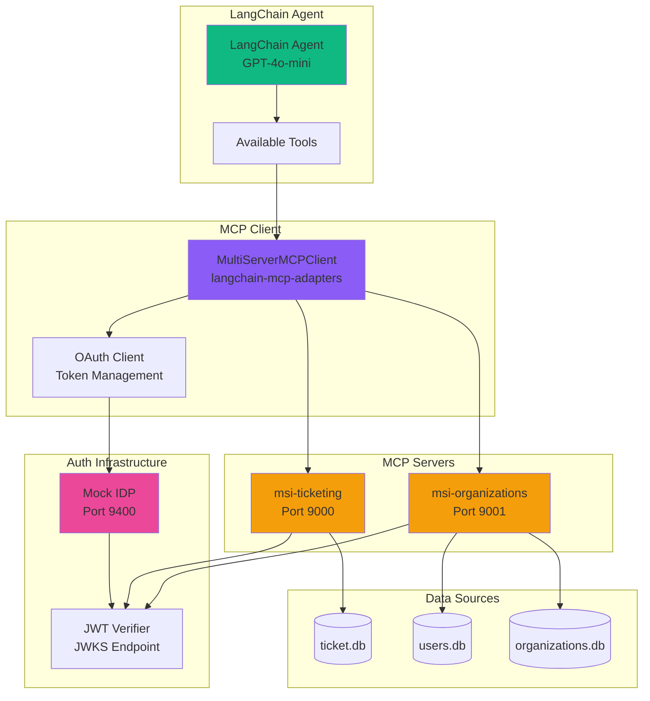
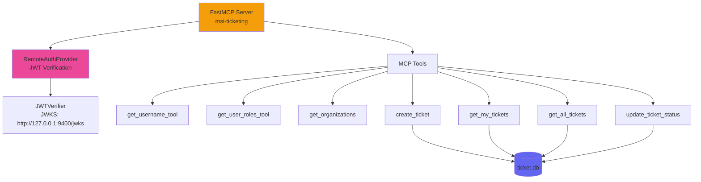
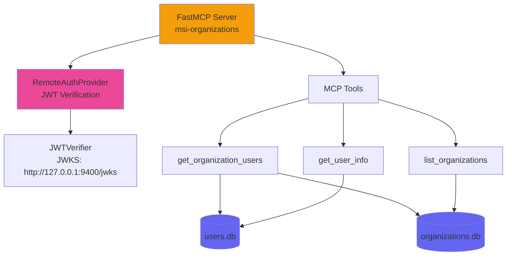
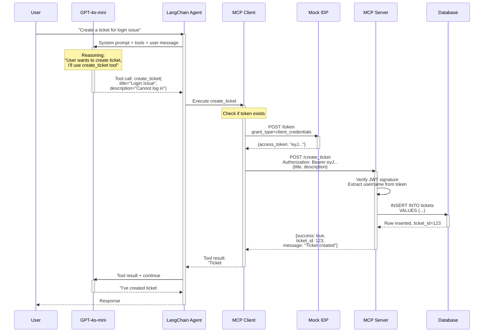
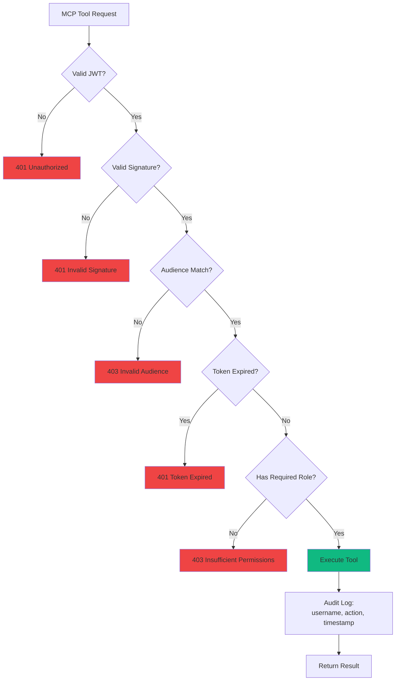

# MCP (Model Context Protocol) Integration Architecture

## MCP System Overview



## MCP Server Structure

### Ticketing MCP Server (`msi-ticketing`)



### Organizations MCP Server (`msi-organizations`)



## Tool Execution Flow



## MCP Configuration in Agent

### Server Configuration

```python
# In src/core/agent.py
from langchain_mcp_adapters.client import MultiServerMCPClient
from fastmcp.client.auth import OAuth

mcp_client = MultiServerMCPClient({
    "ticketing": {
        "url": "http://127.0.0.1:9000",
        "transport": "http",
        "auth": OAuth(
            client_id="test_client",
            client_secret="test_secret",
            token_url="http://127.0.0.1:9400/token",
            scopes=[]
        )
    },
    "organizations": {
        "url": "http://127.0.0.1:9001",
        "transport": "http",
        "auth": OAuth(
            client_id="test_client",
            client_secret="test_secret",
            token_url="http://127.0.0.1:9400/token",
            scopes=[]
        )
    }
})

# Get all MCP tools
mcp_tools = await mcp_client.get_tools()
```

## Tool Metadata Structure

### Example: create_ticket Tool

```json
{
  "name": "create_ticket",
  "description": "Description: Submits a ticket describing user issues.\nUse case: Use this tool to submit a ticket for review on behalf of the user.\nPermissable roles: Any roles.\nArguments: title (required, string), description (required, string).\nReturns: A string conveying the success of the ticket creation.",
  "parameters": {
    "type": "object",
    "properties": {
      "title": {
        "type": "string",
        "description": "The ticket title"
      },
      "description": {
        "type": "string",
        "description": "Detailed description of the issue"
      }
    },
    "required": ["title", "description"]
  }
}
```

## Security Model

### Authentication Layers



### Token Validation Steps

1. **JWT Presence**: Check Authorization header
2. **Signature Verification**: Validate using JWKS public keys
3. **Audience Check**: Ensure token intended for this server
4. **Expiration Check**: Verify token hasn't expired
5. **Role Verification**: Check user has required role for operation

## Tool Categories

### User Context Tools (Both Servers)

| Tool | Server | Purpose | Auth Required |
|------|--------|---------|---------------|
| `get_username_tool` | Both | Get current user's username | Yes |
| `get_user_roles_tool` | Ticketing | Get current user's roles | Yes |
| `get_organizations` | Ticketing | Get current user's orgs | Yes |

### Ticketing Tools

| Tool | Purpose | Roles | Database |
|------|---------|-------|----------|
| `create_ticket` | Create new ticket | Any | ticket.db |
| `get_my_tickets` | Get user's own tickets | Any | ticket.db |
| `get_all_tickets` | Get all tickets | Admin | ticket.db |
| `update_ticket_status` | Change ticket status | Admin | ticket.db |

### Organization Tools

| Tool | Purpose | Roles | Database |
|------|---------|-------|----------|
| `get_organization_users` | List users in org | Any | users.db + organizations.db |
| `get_user_info` | Get user details | Any | users.db |
| `list_organizations` | List all organizations | Any | organizations.db |

## Adding New MCP Servers

### Directory Structure Pattern

```
src/mcp/
├── ticketing/
│   ├── __init__.py
│   └── server.py
├── organizations/
│   ├── __init__.py
│   └── server.py
└── new_server/           # ← New server
    ├── __init__.py
    └── server.py
```

### Server Template

```python
"""
MCP server for [purpose]

Run (from project root):
uv run python -m src.mcp.new_server.server
"""

import pathlib
from fastmcp import FastMCP
from fastmcp.server.auth import RemoteAuthProvider
from fastmcp.server.auth.providers.jwt import JWTVerifier
from pydantic import AnyHttpUrl

from src.auth.utils import check_roles, get_username

SERVER_URL = "http://127.0.0.1:9002"  # Next available port
ISSUER_URL = "http://127.0.0.1:9400"
PROJECT_ROOT = pathlib.Path(__file__).resolve().parent.parent.parent.parent

# JWT Token Verifier
VERIFIER = JWTVerifier(
    jwks_uri = f"{ISSUER_URL}/jwks",
    issuer = ISSUER_URL,
    audience = SERVER_URL
)

# Create RemoteAuthProvider
AUTH = RemoteAuthProvider(
    token_verifier = VERIFIER,
    authorization_servers = [AnyHttpUrl(ISSUER_URL)],
    base_url = AnyHttpUrl(SERVER_URL),
)

# Create FastMCP server instance
mcp = FastMCP(
    name = "msi-new-server",
    auth = AUTH
)

@mcp.tool()
async def example_tool(param: str) -> str:
    """Tool description for LLM."""
    check_roles(["admin"])  # Optional role check
    username = get_username()
    # ... tool logic
    return f"Result for {username}"
```
