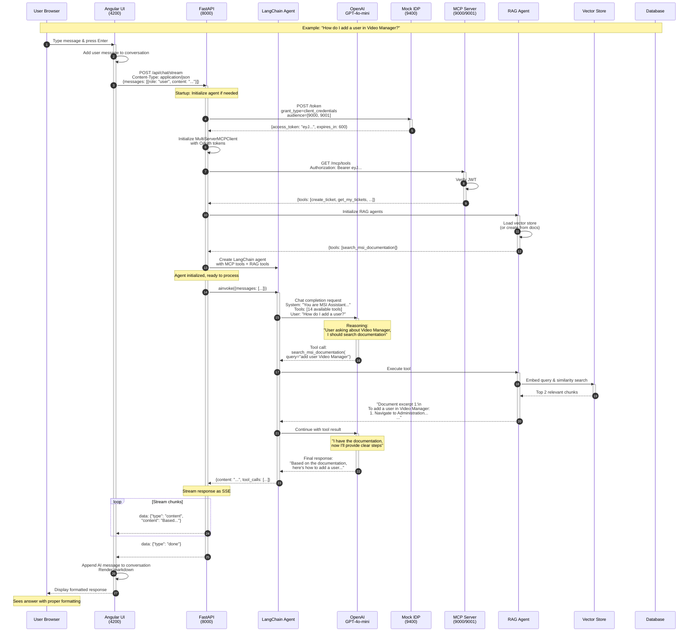
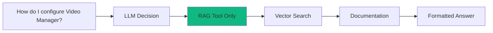
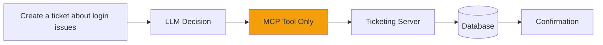
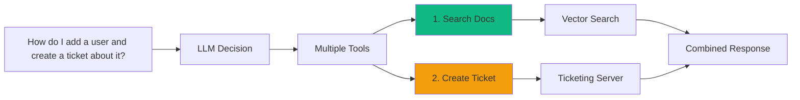
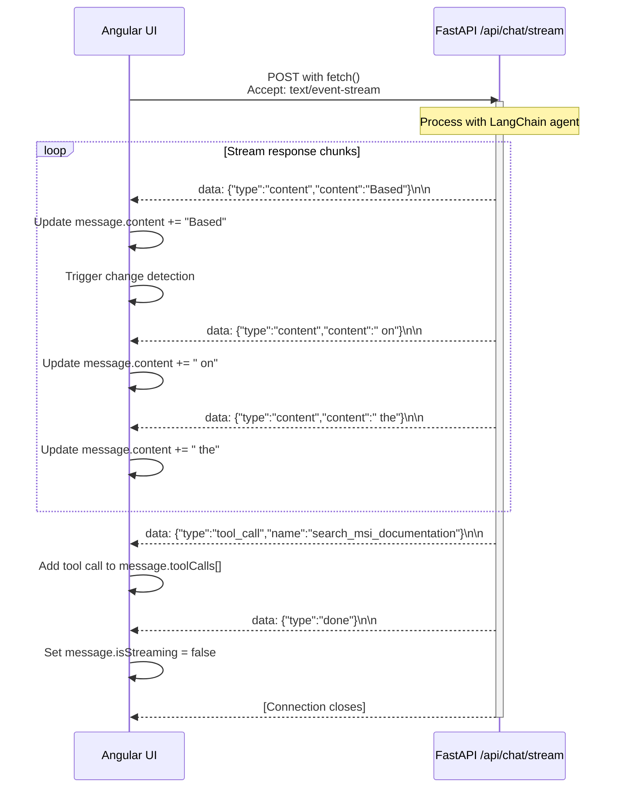
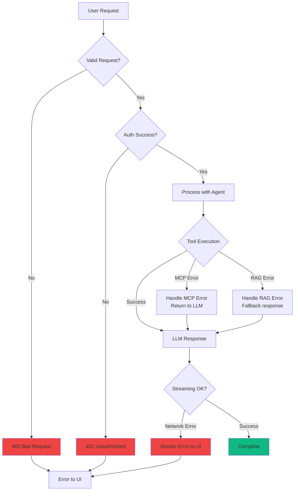
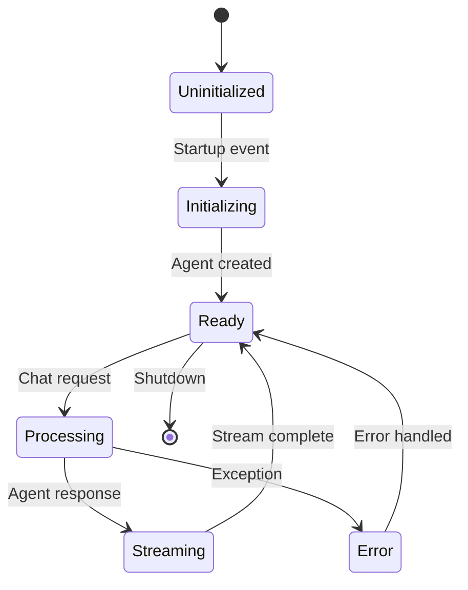
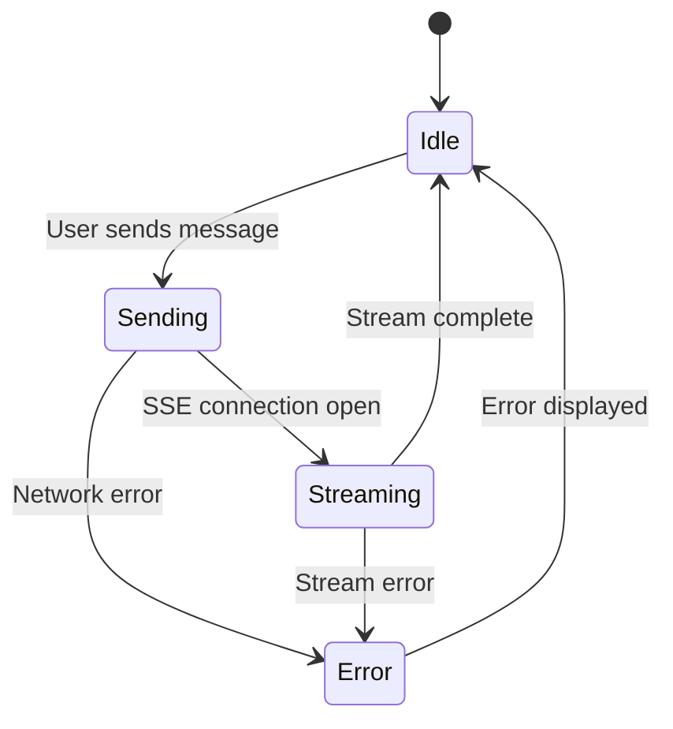
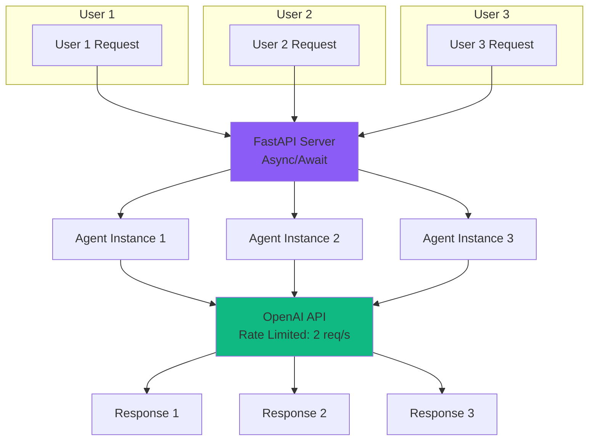

# Complete Request Flow Architecture

## End-to-End Request Flow



## Request Flow Variations

### Scenario 1: Pure Documentation Query



### Scenario 2: Action Request (Create Ticket)



### Scenario 3: Hybrid Request



## Streaming Response Flow

### Server-Sent Events (SSE) Protocol



### SSE Message Types

| Type | Purpose | Example |
|------|---------|---------|
| **content** | Stream text chunks | `{"type":"content","content":"Hello"}` |
| **tool_call** | Notify tool execution | `{"type":"tool_call","name":"create_ticket"}` |
| **error** | Stream errors | `{"type":"error","message":"..."}` |
| **done** | Signal completion | `{"type":"done"}` |

## Error Handling Flow



## Performance Metrics

### Typical Request Breakdown

```mermaid
gantt
    title Request Processing Timeline (Typical Query)
    dateFormat X
    axisFormat %L ms

    section Client
    User Input       :0, 0
    Network (req)    :100
    Network (resp)   :2800, 200

    section API Server
    Request Parse    :100, 50
    Agent Init       :150, 200
    LLM Processing   :350, 2000
    Tool Execution   :2350, 400
    Response Stream  :2750, 250

    section External
    OpenAI API       :400, 1800
    Vector Search    :2400, 200
    MCP Server       :2400, 150
```



### Latency Breakdown

| Phase | Duration | Notes |
|-------|----------|-------|
| **Network (Request)** | 10-50ms | UI → API |
| **Agent Initialization** | 100-300ms | First request only, cached after |
| **LLM Reasoning** | 500-2000ms | Depends on complexity |
| **Tool Execution** | 200-500ms | RAG search or MCP call |
| **Streaming** | 50-200ms | Sending SSE chunks |
| **Network (Response)** | 10-50ms | API → UI |
| **Total** | 870-3100ms | ~1-3 seconds typical |

## State Management

### API Server State



### UI State



## Concurrency Model

### Multiple Users



### Rate Limiting Protection

```python
# In src/core/config.py
RATE_LIMIT_REQUESTS_PER_SECOND = 2  # Conservative limit
RATE_LIMIT_CHECK_INTERVAL = 0.1     # Check every 100ms
RATE_LIMIT_MAX_BUCKET_SIZE = 2      # Burst capacity

# In src/core/agent.py
rate_limiter = InMemoryRateLimiter(
    requests_per_second=RATE_LIMIT_REQUESTS_PER_SECOND,
    check_every_n_seconds=RATE_LIMIT_CHECK_INTERVAL,
    max_bucket_size=RATE_LIMIT_MAX_BUCKET_SIZE,
)
```

**Protection benefits:**
- ✅ Prevents API overspending
- ✅ Stays within OpenAI rate limits
- ✅ Queues requests automatically
- ✅ Configurable per environment
