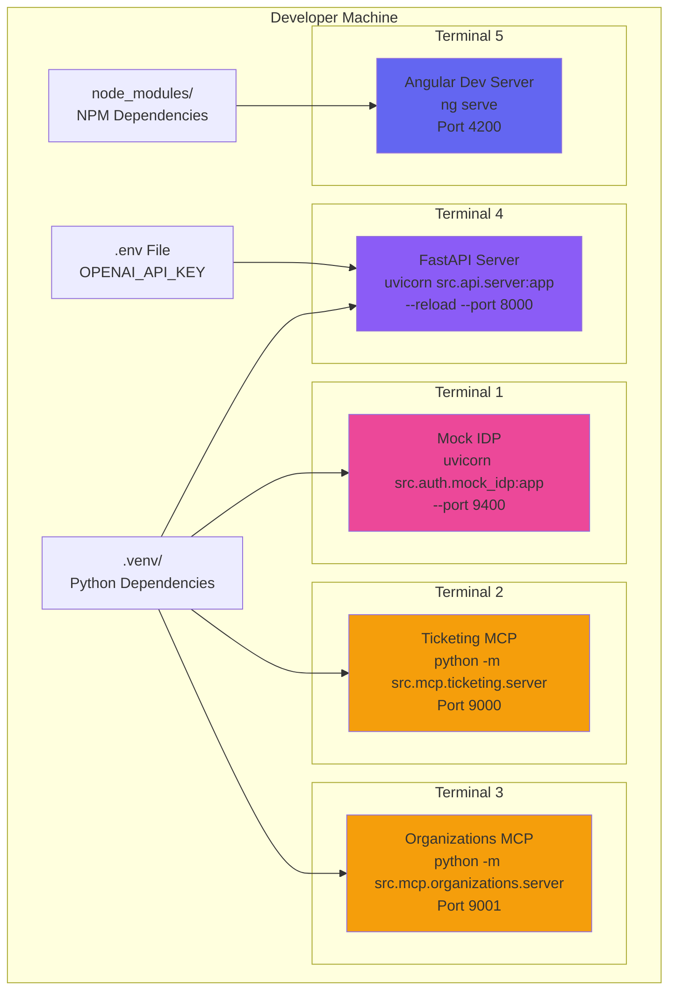
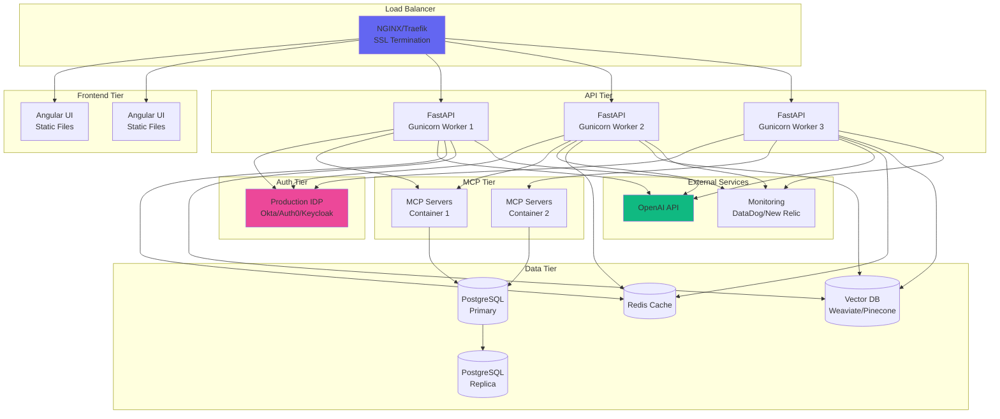
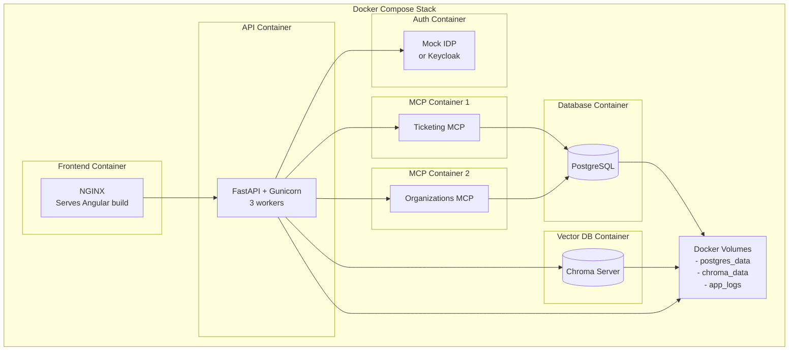
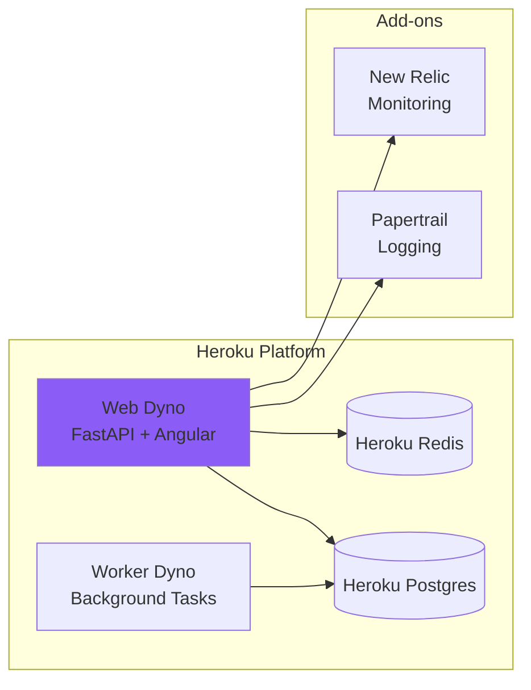
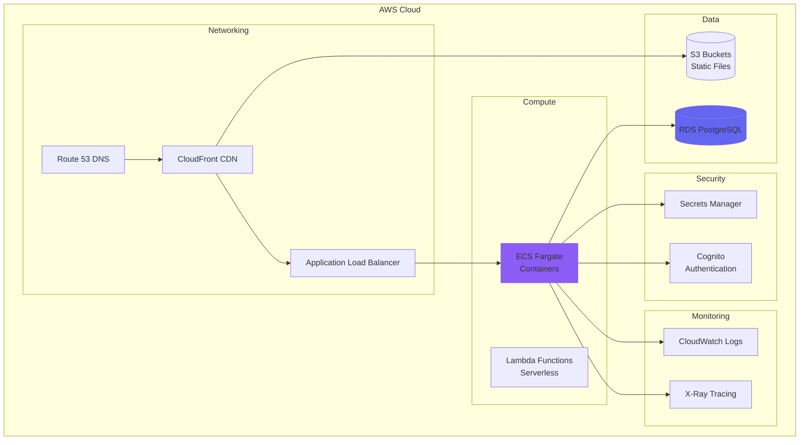
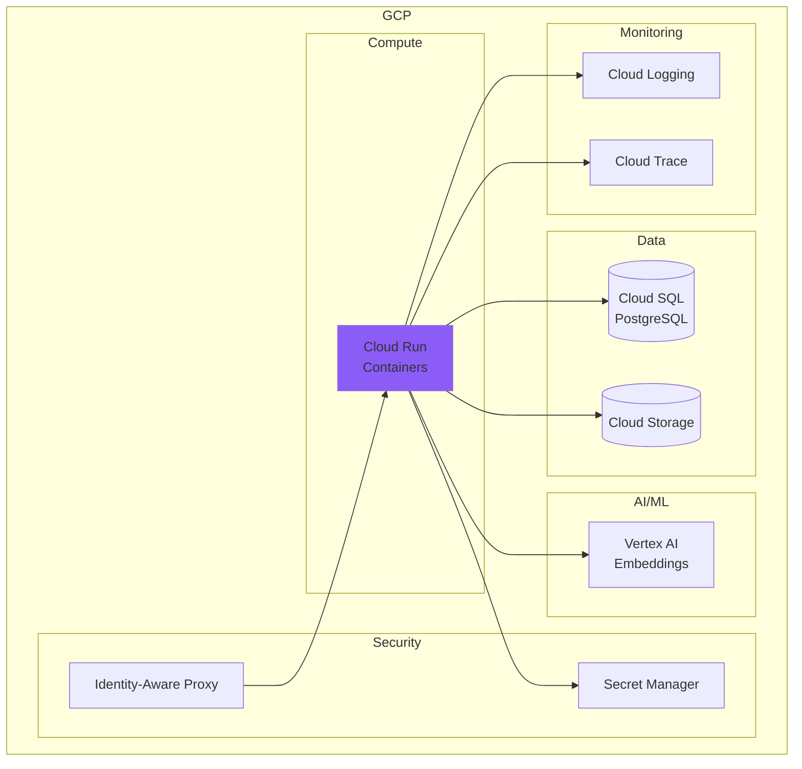
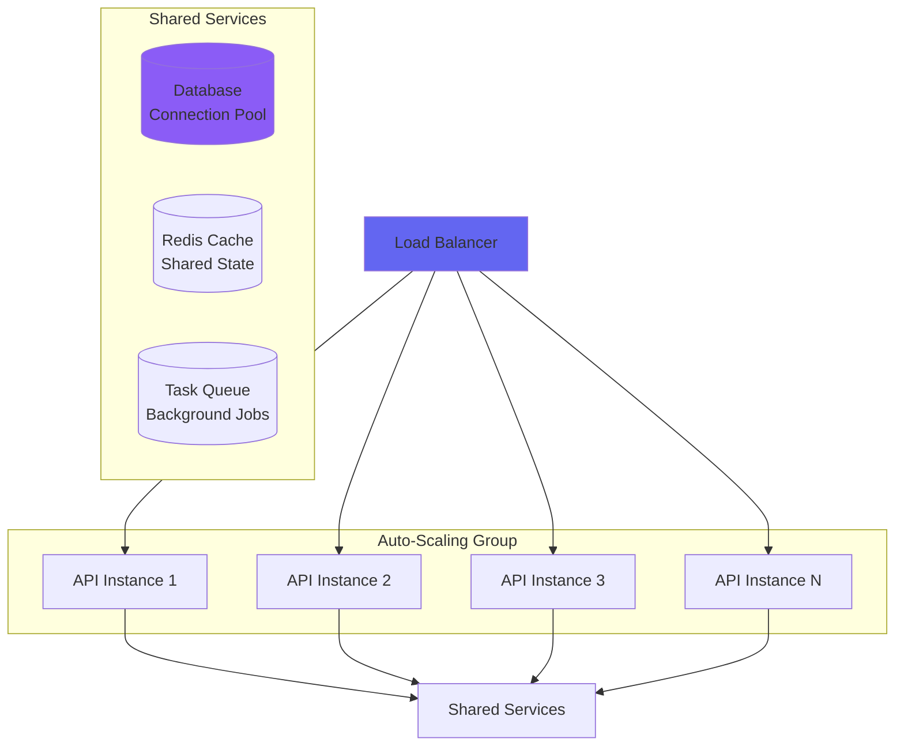
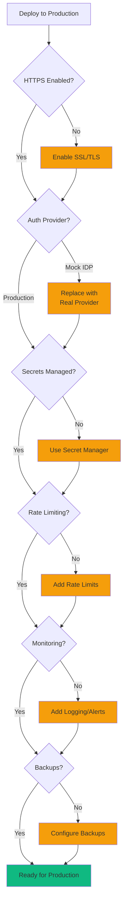
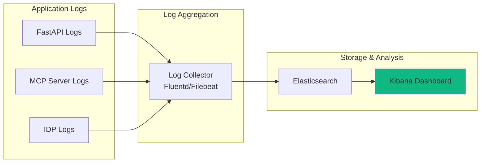
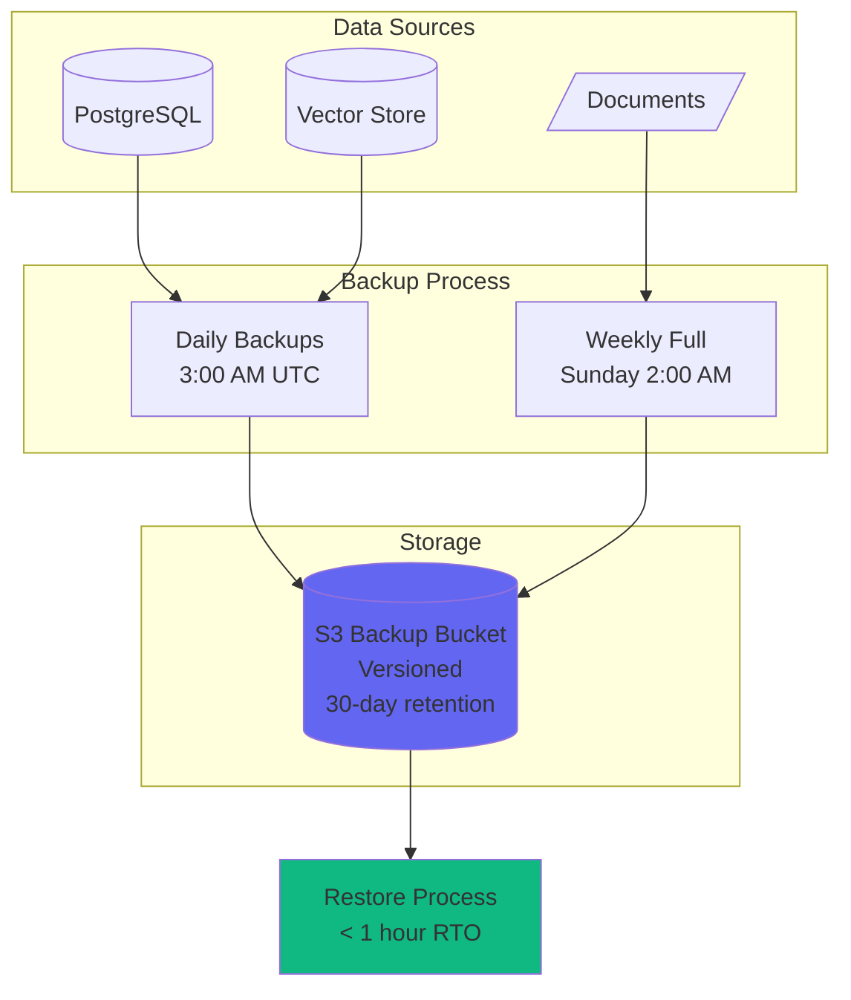

# Deployment Architecture

## Development Environment



## Production Architecture (Future)



## Container Architecture (Docker)



### Docker Compose File Structure

```yaml
version: '3.8'

services:
  # Angular UI (production build)
  ui:
    build: ./ai-assistant-ui
    ports:
      - "80:80"
    depends_on:
      - api

  # FastAPI Server
  api:
    build: .
    ports:
      - "8000:8000"
    environment:
      - OPENAI_API_KEY=${OPENAI_API_KEY}
      - DATABASE_URL=postgresql://user:pass@db:5432/msi
      - CHROMA_URL=http://chroma:8000
    depends_on:
      - db
      - chroma
      - mock-idp
      - mcp-ticketing
      - mcp-organizations

  # Mock IDP (or real auth provider)
  mock-idp:
    build:
      context: .
      dockerfile: Dockerfile.idp
    ports:
      - "9400:9400"

  # MCP Servers
  mcp-ticketing:
    build:
      context: .
      dockerfile: Dockerfile.mcp
      args:
        MCP_SERVER: ticketing
    ports:
      - "9000:9000"
    depends_on:
      - db
      - mock-idp

  mcp-organizations:
    build:
      context: .
      dockerfile: Dockerfile.mcp
      args:
        MCP_SERVER: organizations
    ports:
      - "9001:9001"
    depends_on:
      - db
      - mock-idp

  # PostgreSQL Database
  db:
    image: postgres:16
    environment:
      POSTGRES_USER: msi_user
      POSTGRES_PASSWORD: ${DB_PASSWORD}
      POSTGRES_DB: msi_db
    volumes:
      - postgres_data:/var/lib/postgresql/data
    ports:
      - "5432:5432"

  # Chroma Vector Database
  chroma:
    image: chromadb/chroma:latest
    ports:
      - "8001:8000"
    volumes:
      - chroma_data:/chroma/chroma

volumes:
  postgres_data:
  chroma_data:
```

## Cloud Deployment Options

### Option 1: Heroku



**Procfile:**
```
web: uvicorn src.api.server:app --host 0.0.0.0 --port $PORT
```

### Option 2: AWS



### Option 3: Google Cloud Platform



## Scaling Considerations

### Horizontal Scaling



### Performance Optimization

| Layer | Strategy | Implementation |
|-------|----------|----------------|
| **API** | Response caching | Redis cache for repeated queries |
| **LLM** | Prompt caching | OpenAI prompt caching (future) |
| **RAG** | Vector indexing | Pre-compute embeddings |
| **Database** | Connection pooling | SQLAlchemy pool |
| **Static Assets** | CDN | CloudFront/Cloudflare |

## Security Hardening

### Production Checklist



### Environment Variables

**Development (`.env`):**
```bash
OPENAI_API_KEY=sk-...
DATABASE_URL=sqlite:///data/databases/
ENVIRONMENT=development
DEBUG=true
```

**Production:**
```bash
OPENAI_API_KEY=<from-secret-manager>
DATABASE_URL=postgresql://prod-db:5432/msi
ENVIRONMENT=production
DEBUG=false
ALLOWED_ORIGINS=https://msi-assistant.com
RATE_LIMIT_REQUESTS=10
```

## Monitoring & Observability

### Logging Architecture



### Metrics to Monitor

| Metric | Purpose | Alert Threshold |
|--------|---------|-----------------|
| **Response Time** | User experience | > 3 seconds |
| **Error Rate** | System health | > 5% |
| **OpenAI API Calls** | Cost control | > budget |
| **Token Usage** | Cost control | > budget |
| **Database Connections** | Resource limits | > 80% pool |
| **Memory Usage** | Resource limits | > 85% |
| **CPU Usage** | Resource limits | > 80% |

## Backup & Recovery

### Backup Strategy



### Disaster Recovery

**Recovery Time Objective (RTO):** < 1 hour
**Recovery Point Objective (RPO):** < 24 hours

**DR Runbook:**
1. Provision new infrastructure
2. Restore database from S3 backup
3. Restore vector store from backup
4. Deploy latest application code
5. Update DNS to new endpoints
6. Verify functionality
